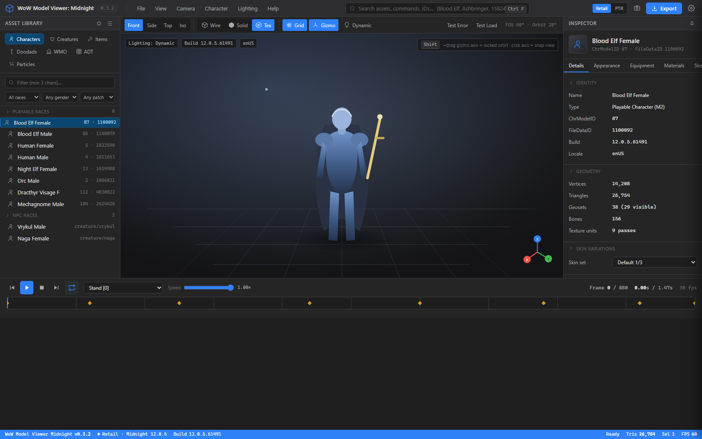
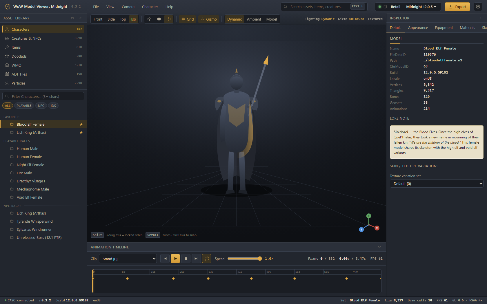
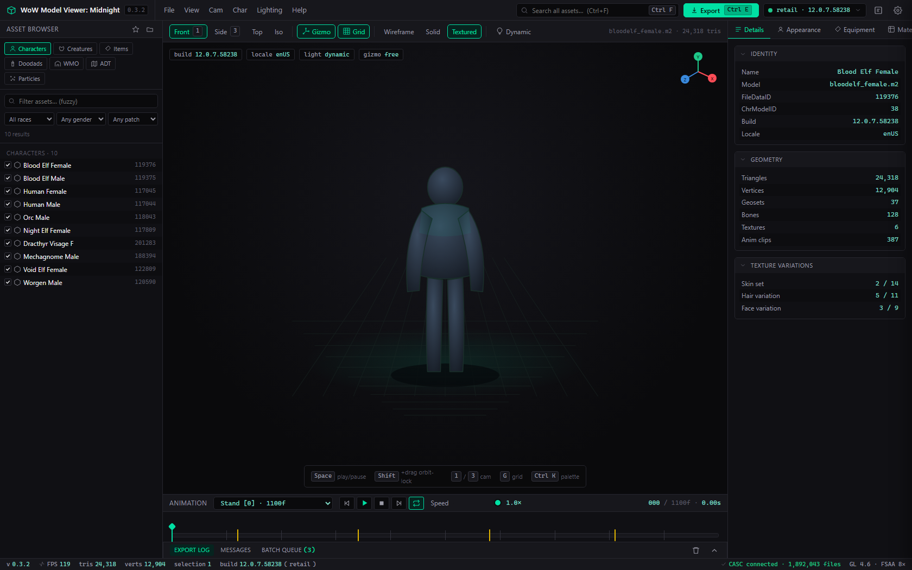

# WoW Model Viewer - 2026 UI Overhaul Exploration

This document records a UI-overhaul exploration for WoW Model Viewer: Midnight (v0.3.2). It is backed by three standalone HTML design prototypes that illustrate different directions for a modernized shell. These are static mockups only — the live C++/wxWidgets application is unchanged, and nothing here alters model loading, customization, or export behavior.

## Current UI audit

The shell is unmistakably 2005-era: a wxWidgets 3.2 **wxAUI** docking frame (default 1024×768) wrapped in raw Win32 chrome — system title bar, native gray menu strip, beveled `wxNotebook` tabs, and a **5-field status bar** where two fields (4 and 5, 125px each) are permanently blank. There is **no toolbar at all** — every action lives in a menu or a hidden hotkey.

**Outdated layout.** Panels are cramped and fixed-feeling: **File List** and **Character** dock at a hardcoded 170×700 best-size, while **Models** (160×460), **Model Bank** (300×320), and **Settings** (400×550) float *off-canvas and hidden by default*, easy to lose with no "dock all" beyond **File ▸ Reset Layout**. Customization, animation, and model properties are scattered across three separate side panes with no unified or tabbed home.

**Menu-heavy.** Six top-level menus with deep submenus carry the weight — **View ▸ Set Canvas Size** alone lists **13 resolutions** in one flat list, and **View ▸ Lighting** exposes a jargon radio group with no preview of what each mode renders. The asset browser is a **raw file-path tree** (`Character\Human\Male\`, `creature\`, `item\`) with `[FileDataID]` suffixes and no thumbnails. There is **no dark mode, no global search, no batch export, and no presets**; the backing store has no concept of a saved layout or export preset beyond a single `DefaultFormat` int.

**Friction workflows.**
- *Finding an asset* means navigating a path tree by memory; worse, **searching collapses the curated Playable/NPC race view back to the raw `character/` folder**, so the friendly browser vanishes exactly when you filter. Equipping is a modal chain (click slot → item dialog → wildcard filter → subclass checkboxes → single-select) with no drag-drop or multi-equip.
- *Choosing destination + format* is inconsistent and modal-heavy: FBX/OBJ/GIF/Screenshot use a *file* picker while Image Sequence uses a *folder* picker, each with options hidden inside the dialog until you commit.
- *Knowing an export succeeded* varies wildly: FBX and Image Sequence give modeless progress + a `.log` sidecar, but **GIF and AVI block the UI with no feedback**, and Screenshot is silent. Overwrite protection is a cheap "does frame 0 exist?" heuristic.
- *Discovering customization* is opaque — geosets toggle only on double-click, visibility flags hide in the **Character** menu rather than the panel, and the gizmo's snap/orbit behavior has no on-screen hint.

**What MUST be preserved.** Full CASC asset access (the explicit Load-WoW gate, lazy 130k+ file tree, curated ChrRaces browser); character-customization depth (per-`ChrModelID` options, 14 equipment slots with quality coloring, tabard editor, item sets, mounts, geoset toggles, Armory import); rigged out-of-process FBX + timer-driven PNG/JPG/EXR image-sequence export; full animation playback (freeze/thaw clip combo, transport, speed, scrubber, secondary/mouth tracks, NextAnimation chaining); the orbit viewport + Blender-style axis gizmo + four lighting modes; and session/layout persistence (`Config.ini` keys, F5–F9 saves, off-screen recovery, restart-on-path-change safeguard).

## Design goals

1. **Modern desktop feel** — replace floating AUI panes and bare Win32 chrome with a single predictable five-zone shell using DCC conventions (browse left, focus center, edit right, time bottom).
2. **Safer, clearer export** — normalize every format into one *Destination → Format → Options/Preview → Warnings → Progress → Result* flow with consistent progress and logging; add presets and a batch queue.
3. **Faster asset finding** — category-first library with faceted filters, thumbnails, and a search that *never* destroys the curated race browser.
4. **First-class dark mode** — a real theming system (Ctrl+D), not a single grey backdrop.
5. **Preserve depth** — surface, never remove, the customization/equipment/animation/material/skeleton power features; keep the raw file tree available under Advanced.
6. **Discoverable controls** — promote hidden menu actions (visibility flags, lighting modes, gizmo behavior) into a toolbar, panel chrome, and on-canvas HUD with tooltips and previews.
7. **No lost panels** — fixed dock zones eliminate "lost floating panel" recovery; the timeline can never be closed or misplaced.
8. **Keyboard-first** — a coherent, documented shortcut map (Ctrl+F/O/E, Space, F5–F10, etc.).
9. **Scales to real data volumes** — virtualized result grids preserving freeze/thaw batching for 40k+ rows and 380+-clip models.
10. **Behavior-preserving** — the modern UI is a reskin over the existing engine; model loading and exporting semantics do not change.

## Information architecture

**Five-zone shell** replaces scattered AUI panes:
- **Top Command Bar** — global search, data-source/product switch (retail/PTR), Load-WoW state, export, screenshot; legacy six menus collapse into grouped overflow.
- **Left Browser** — the asset library (replaces File List); resizable, never floating off-screen.
- **Center Viewport** — OpenGL canvas with corner gizmo, grid, skybox, and an on-canvas HUD (lighting mode, gizmo lock, build/locale moved out of the cryptic status bar).
- **Right Inspector** — tabbed: Details, Appearance/Customization, Equipment, Materials/Textures, Skeleton/Attachments.
- **Bottom Timeline** — always-docked transport linked to the GL render loop.

**Asset browser** is category-first (Characters, Creatures & NPCs, Items, Doodads, WMO, ADT, Particles) with faceted filters (race/gender, slot→subclass, quality tier, CreatureType, "added in patch," ID range), a virtualized zebra results grid with optional `[FileDataID]` badges + quality colors, a Recents/Favorites shelf, and an **Advanced ▸ Raw File Tree** escape hatch for power users.

**Animation timeline** carries a searchable "Name [index]" clip dropdown (freeze/thaw), Loops/Next-chaining, a Layers expander for secondary/mouth tracks, full transport, a 0.1×–4.0× speed slider, and a frame scrubber with N/total + duration readout.

**Export** is a single wizard normalizing FBX/OBJ/Image-Sequence/Screenshot/Video/Textures through *Destination → Format → Options/Preview → Warnings → Progress → Result*, with save/recall presets and a sequential **batch queue** (one model × N animations × N formats) plus a summary report.

**Settings** are grouped: Data Sources/CASC, Viewport, Export Defaults, Integrations/Armory, Advanced (Config.ini keys preserved, restart prompt on path change).

**Keyboard:** Ctrl+F search, Ctrl+O load, Ctrl+E export, F12/Ctrl+S screenshot, Space/`.` play/stop, `,`/`;` prev/next clip, F5/F6/F9 equipment, F7/F8 character, F10 randomise, 1/2/3/0 camera, G/X grid/gizmo, Ctrl+Z/Ctrl+H sheathe/hair, Ctrl+D dark mode.

## The prototypes

### A — Modern Professional Tool

**What it is.** A neutral, DCC-style dark shell (think Blender 4.x / Substance) with a slim command bar, faceted left library, tabbed right inspector, and a docked bottom timeline. Restrained palette, crisp typography, no game theming.

**Who it's for.** Animators, artists, and pipeline users who want WoW Model Viewer to feel like the other tools in their content workflow and value legibility and density over flavor.

**Standout features.** Unified export wizard with the full Destination→Result flow and preset chips; category-first asset library with quality-colored result grid; on-canvas HUD replacing the dead status-bar fields; clean first-class dark mode.

Live file: [./ui-overhaul-2026/prototype-a-modern-pro.html](./ui-overhaul-2026/prototype-a-modern-pro.html)

### B — WoW Themed Modern

**What it is.** The same five-zone IA dressed in a modernized Warcraft skin — parchment/gold accents, faction-tinted quality colors, ornate-but-restrained panel headers — while keeping flat, readable modern controls underneath.

**Who it's for.** Community creators, machinima makers, and long-time WMV users who want the tool to *feel* like World of Warcraft without sacrificing the modern layout and workflows.

**Standout features.** Themed asset cards with in-grid quality coloring; a flavored Load-WoW / product switcher; equipment slot grid styled like the in-game character sheet; theming proves the dark-mode system can carry a full brand skin, not just grey.

Live file: [./ui-overhaul-2026/prototype-b-wow-themed.html](./ui-overhaul-2026/prototype-b-wow-themed.html)

### C — Power User / Technical

**What it is.** A dense, information-maximizing layout exposing IDs, build/locale, geoset stats, and raw data up front — closest to the existing tool's depth but reorganized and modernized. Compact rows, monospace IDs, more on-screen at once.

**Who it's for.** Data miners, addon/tool developers, and advanced users who live in FileDataIDs, the raw file tree, the materials/skeleton tabs, and the batch export queue.

**Standout features.** Always-visible `[FileDataID]` badges and Advanced ▸ Raw File Tree promoted to a first-class browser mode; full Materials/Textures and Skeleton/Attachments inspector tabs; batch export queue with per-job progress; maximum data density per pane.

Live file: [./ui-overhaul-2026/prototype-c-power-user.html](./ui-overhaul-2026/prototype-c-power-user.html)

## How to launch

Open any prototype `.html` in a browser — double-click it, or drag it into Chrome/Edge. For a side-by-side overview, open [./ui-overhaul-2026/index.html](./ui-overhaul-2026/index.html), a launcher gallery linking all three. Every prototype is **static, offline, and fully self-contained** — no build step, server, or network access required.

## Implementation notes

These are **HTML/CSS/JS mockups, not the C++ application**. None of this code ships in or links against the wxWidgets build; they exist purely to evaluate layout and visual direction.

- **Viewport** — the central 3D canvas is a **CSS/SVG faux-3D placeholder** (a stylized stand-in model), not a real OpenGL render. It conveys framing and HUD overlay only.
- **Data** — all labels (race names, item names, clip names, FileDataIDs, build strings) are **real WoW labels used as static placeholder data** to make the mockups read realistically; they are not wired to CASC or any listfile.
- **Interactive vs static.** Interactive: tab switching, panel/section expand-collapse, hover states, dark/theme toggles, and the export-wizard step navigation where present. Static: the viewport render, search results, actual asset loading, and any real export — buttons that would touch the engine are visual only and perform no work.

## Risks & migration plan

The gap from these mockups to a real shipped UI is large; the prototypes show *intent*, not a port.

- **wxWidgets styling limits.** wxWidgets 3.2 renders largely native controls; the rounded cards, custom headers, and theming shown here are **not achievable with stock wxAUI/wxNotebook** without heavy owner-draw/custom-control work. A faithful reskin in pure wxWidgets would be costly and still constrained.
- **Qt vs wxWidgets.** Qt Widgets/QML offers far stronger styling (QSS, scene graph) and would make a design like this realistic — but a Qt port is a major undertaking and would touch the entire UI layer. A staged option is a **future shell that embeds a webview** (host these HTML panels) or a **gradual move to Qt Widgets/QML** for new panels.
- **Incremental, panel-by-panel migration.** Recommended path: keep the existing frame and migrate **one dock zone at a time** (e.g., the export wizard first, then the asset browser), validating each against current behavior before moving on. No big-bang rewrite.
- **Preserve the engine.** Whatever the shell, the **OpenGL viewport, the FBX/image-sequence exporters, and session/layout persistence (`Config.ini`, F5–F9, off-screen recovery, restart-on-path-change) must be carried over intact**. The reskin must introduce **no behavior change to model loading or exporting** — same CASC gate, same customization rows, same export semantics and logs.

## Recommended direction

**Adopt Prototype A (Modern Professional Tool) as the primary direction, with Prototype C's data density folded in as an optional "Technical" density mode.** Rationale:

- A's neutral DCC layout best satisfies the audit's core goals — legibility, a unified inspector, the safe export flow, and real dark mode — without betting the redesign on a heavy themed skin that is hardest to reproduce in a native toolkit.
- C's strengths (always-visible FileDataIDs, the promoted raw file tree, Materials/Skeleton tabs, batch queue) are **additive**: ship them as a toggle/density preference inside A rather than a separate UI, preserving the power-user depth the audit says MUST be kept.
- B's themed skin is the riskiest to render in wxWidgets and is best deferred to an optional theme once the theming system exists; A's dark-mode work lays that groundwork.

**Concrete next steps:**
1. Lock the five-zone IA and the export-wizard flow against the preserved-features list (sign-off that nothing in the "MUST preserve" set is dropped).
2. Run a small spike to decide the rendering toolkit: prototype the **export wizard** as (a) custom wxWidgets and (b) an embedded webview, and compare effort/fidelity.
3. Define the theming/token system (colors, spacing, typography) so dark mode and a later WoW theme share one foundation.
4. Migrate the **export wizard** first (highest friction, self-contained, behavior-preserving), then the **asset browser**, validating each against current `Config.ini` persistence and engine behavior before continuing.
